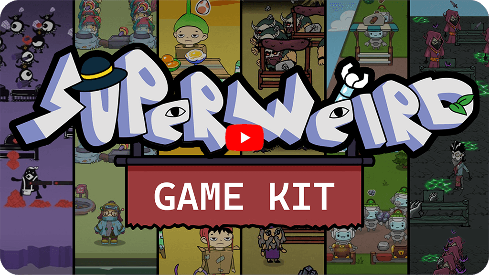
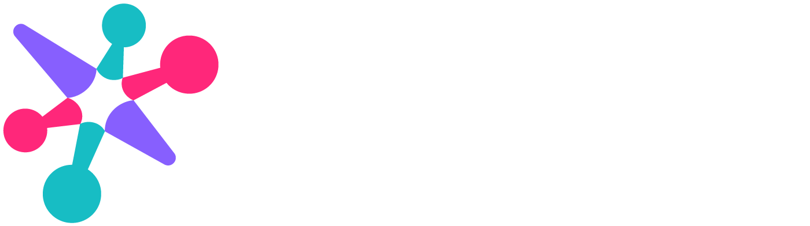

[English](README.md)        [Русский](README_Russian.md)        [中文](README_Chinese.md)        [हिन्दी](README_Hindi.md)        [Español](README_Spanish.md)        [Français](README_French.md)        [Deutsch](README_German.md)        [Português](README_Portuguese.md)        [日本語](README_Japanese.md)        [Bahasa Indonesia](README_Indonesian.md)        [Svenska](README_Swedish.md)        [Беларуская](README_Belarusian.md)        [Українська](README_Ukrainian.md)        [Polski](README_Polish.md)        [Nederlandse](README_Dutch.md)

# SuperWEIRD Game Kit

Hi! At [Luden.io](https://luden.io?utm_source=superweirdgamekit&utm_medium=github) we’re developing [SuperWEIRD](https://superweird.shop?utm_source=superweirdgamekit&utm_medium=github) (see the game on [Steam](https://store.steampowered.com/app/3818770/SuperWEIRD/?utm_source=superweirdgamekit&utm_medium=github)). It’s a co-op game about designing and automating systems with lemming-like robots, built with the [Defold](https://defold.com) engine.

Early in development we ran many experiments with visual styles and gameplay. We figured these might be useful to other developers and decided to release the code, textures, and animations from those experiments under the open [CC0](LICENSE) license.

In this repository you’ll find six different visual styles ([video](https://youtu.be/RJwOEDY3MP4)) and the gameplay logic of a shop/production simulator. The player fulfills customer orders and expands production. You can play the [demo on itch.io](https://ludenio.itch.io/superweird-game-kit?utm_source=superweirdgamekit&utm_medium=github).

Join our [Discord](https://discord.gg/ludenio) to tell us what you’d build with these prototypes. Or check out our [YouTube channel](https://www.youtube.com/@ludenio) — there’s a lot of good stuff, including the [SuperWEIRD dev diaries](https://www.youtube.com/@ludenio/videos).

Links:
- Discord (we’re there every day): https://discord.gg/ludenio
- YouTube: https://www.youtube.com/@ludenio
- Newsletter with updates and text dev diaries: https://ludenio.substack.com/
- Twitter (X): https://x.com/luden_io

# Partners

SuperWEIRD is being created with support from [Carina Initiatives](https://www.carina.fund/?utm_source=ludenio&utm_medium=superweirdwebsite&utm_campaign=carina_banner&utm_content=fun), a philanthropic fund working to give kids from diverse communities access to science and technology. They see mathematics as the foundation of future innovation and fund organizations that inspire and develop mathematical talent. If you’re interested in other educational projects, check out Carina Initiatives’ partners:

# Quick Start

1. Install **Defold 1.13.1** from https://defold.com (the version verified for this project).
2. Clone or download the repository.
3. Open `game.project` in Defold Editor.
4. Select **Project → Fetch Libraries**, then **Project → Build** (Cmd+B on macOS).
5. Choose a world. Move with WASD or the arrow keys, approach a construction pad to build, and use **Menu** to return to world selection.

The dependencies are pinned for reproducible builds: Spine 4.7.8, Druid 1.3.0, Event 16, and Metrics commit `a8b31bf7a680e65e0f5a9d4a2b654d849b5ffd3c`. Spine 4.7.8 supports Defold 1.13.1; upgrading Spine further may require a newer engine.

Note: Editing Spine animations requires the Spine Editor.

# Project Structure

1. Loading
   - `loader` — starts with the game, remains in memory, and manages loading/unloading collections via the Collection Proxy; on launch it initializes the start menu.
   - `menu` — the start menu shown when the game starts.

2. Core
   - `main` — shared game code: scripts and modules used across all worlds; contains the entire game logic.
   - `assets` — game assets: textures, Spine models, tilemaps, and atlases. Each world has its own folder `world_1`, `world_2`, etc., with unique visuals.
   - `worlds` — visual setup of worlds: collections and game objects. Each world is a separate collection in `world_1`, `world_2`, etc.

3. Extras
   - `SuperWEIRDGameKit_assets` — an organized set of graphics and Spine models used in the project.

# World Management Logic

- World switching is handled via `loader`, which loads and unloads collections.
- World customization: update visual parameters and game objects in `worlds/world_X`, and graphics in `assets/world_X`.

## Adding a New World

1. Create folders `assets/world_N` and `worlds/world_N`.
2. Copy a template from an existing world.
3. Register the new world in the loader/menu code (see logic in `main`).
4. Ensure collections and assets are correctly linked.
