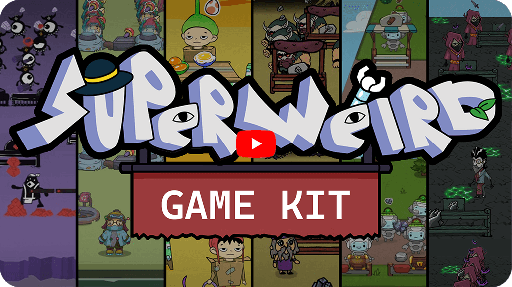
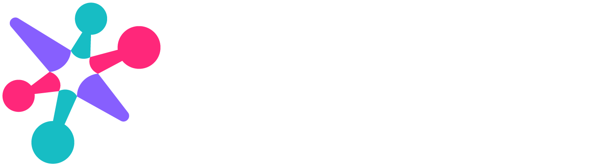
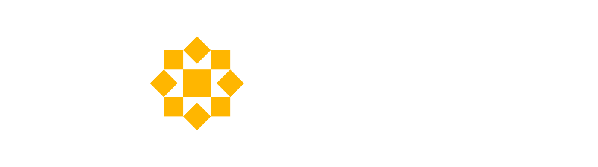
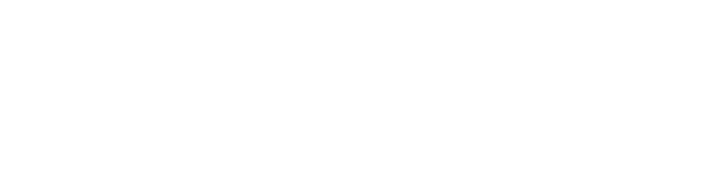

[English](README.md)        [Русский](README_Russian.md)        [中文](README_Chinese.md)        [हिन्दी](README_Hindi.md)        [Español](README_Spanish.md)        [Français](README_French.md)        [Deutsch](README_German.md)        [Português](README_Portuguese.md)        [日本語](README_Japanese.md)        [Bahasa Indonesia](README_Indonesian.md)

# SuperWEIRD Game Kit

Salut ! Chez [Luden.io](https://luden.io?utm_source=superweirdgamekit&utm_medium=github), nous développons [SuperWEIRD](https://superweird.shop?utm_source=superweirdgamekit&utm_medium=github) (voir le jeu sur [Steam](https://store.steampowered.com/app/3818770/SuperWEIRD/?utm_source=superweirdgamekit&utm_medium=github)). C’est un jeu en coopération sur la conception et l’automatisation de systèmes avec des robots semblables à des lemmings, réalisé avec le moteur [Defold](https://defold.com).

Au début du développement, nous avons mené de nombreuses expériences sur les styles visuels et le gameplay. Nous nous sommes dit que cela pourrait être utile à d’autres développeurs et avons décidé de publier le code, les textures et les animations issus de ces expériences sous la licence ouverte [CC0](LICENSE).

Dans ce dépôt, vous trouverez six styles visuels différents ([video](https://youtu.be/RJwOEDY3MP4)) et la logique de gameplay d’un simulateur de magasin/production. Le joueur exécute les commandes des clients et développe la production. Vous pouvez jouer à la [demo on itch.io](https://ludenio.itch.io/superweird-game-kit?utm_source=superweirdgamekit&utm_medium=github).

Rejoignez notre [Discord](https://discord.gg/ludenio) pour nous dire ce que vous construiriez avec ces prototypes. Ou jetez un œil à notre [YouTube channel](https://www.youtube.com/@ludenio) — il y a beaucoup de contenu intéressant, y compris les [SuperWEIRD dev diaries](https://www.youtube.com/@ludenio/videos).

Liens :
- Discord (nous y sommes tous les jours) : https://discord.gg/ludenio
- YouTube : https://www.youtube.com/@ludenio
- Newsletter avec des mises à jour et des journaux de développement : https://ludenio.substack.com/
- Twitter (X) : https://x.com/luden_io

# Partenaires

SuperWEIRD est créé avec le soutien de [Carina Initiatives](https://www.carina.fund/?utm_source=ludenio&utm_medium=superweirdwebsite&utm_campaign=carina_banner&utm_content=fun), un fonds philanthropique qui œuvre pour donner aux enfants de communautés diverses l’accès aux sciences et aux technologies. Ils considèrent les mathématiques comme le fondement des innovations futures et financent des organisations qui inspirent et développent les talents en mathématiques. Si vous vous intéressez à d’autres projets éducatifs, découvrez les partenaires de Carina Initiatives :

# Démarrage rapide

1. Installez Defold Editor : https://defold.com
2. Clonez ou téléchargez le dépôt.
3. Ouvrez le dossier du projet dans Defold Editor.
4. Compilez et exécutez le projet.

Remarque : la modification des animations Spine nécessite Spine Editor.

# Structure du projet

1. Chargement
   - `loader` — démarre avec le jeu, reste en mémoire et gère le chargement/la décharge des collections via le Collection Proxy ; au lancement, il initialise le menu de démarrage.
   - `menu` — le menu de démarrage affiché au lancement du jeu.

2. Base
   - `main` — code commun du jeu : scripts et modules utilisés dans tous les mondes ; contient toute la logique de jeu.
   - `assets` — ressources du jeu : textures, modèles Spine, tilemaps et atlas. Chaque monde possède son propre dossier `world_1`, `world_2`, etc., avec des visuels uniques.
   - `worlds` — configuration visuelle des mondes : collections et objets de jeu. Chaque monde est une collection séparée dans `world_1`, `world_2`, etc.

3. Extras
   - `SuperWEIRDGameKit_assets` — un ensemble organisé de graphismes et de modèles Spine utilisés dans le projet.

# Logique de gestion des mondes

- Le changement de monde est géré via `loader`, qui charge et décharge des collections.
- Personnalisation d’un monde : mettez à jour les paramètres visuels et les objets de jeu dans `worlds/world_X`, et les graphismes dans `assets/world_X`.

## Ajouter un nouveau monde

1. Créez les dossiers `assets/world_N` et `worlds/world_N`.
2. Copiez un modèle à partir d’un monde existant.
3. Enregistrez le nouveau monde dans le code du loader/du menu (voir la logique dans `main`).
4. Assurez-vous que les collections et les ressources sont correctement liées.
